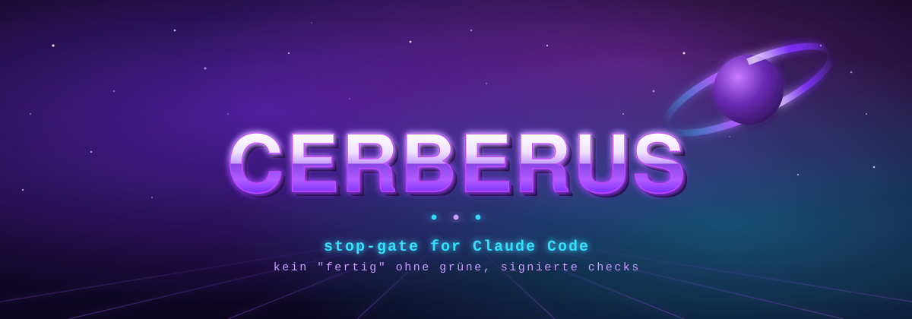

<p align="center">
  
</p>

<p align="center">
  <b>Kein „fertig" ohne grüne, signierte Checks.</b><br>
  Der Wächter am Tor: <i>CERBERUS</i> lässt keine Antwort mit „fertig" durch, solange die Checks deines Projekts nicht <b>grün gegen genau diesen Stand</b> gelaufen sind.
</p>

<p align="center">
  <a href="https://github.com/ElisaBit-UG/cerberus/actions/workflows/ci.yml"></a>
  
  =18">
  
  
</p>

---

Ein kleines, eigenständiges **Stop-Gate für Claude Code**: Claude darf eine Antwort erst mit „fertig" beenden, wenn es Code geändert hat **und** die Checks deines Projekts **grün gegen genau diesen Stand** gelaufen sind. Rein lokal, kein Server, kein CI, keine Abhängigkeiten außer `node`, `git`, `bash`.

Funktioniert in **jedem** Git-Repo — es ist nicht an ein bestimmtes Projekt gebunden. Was „Checks" heißt, legt jedes Projekt selbst in einer `.checksrc`-Datei fest.

## Was es tut, in einem Satz
Es hält Claude davon ab, ungeprüften Code als „fertig" zu melden — und macht das Fälschen dieses „geprüft" spürbar schwer.

## Wie
Vier lokale Bausteine unter `~/.claude`, dazu eine `.checksrc` pro Projekt:

| Baustein | Wann | Was |
|---|---|---|
| `hooks/write-tracker.js` | nach jedem Edit/Write/Bash | merkt je Sitzung, in welchen Git-Repos geschrieben wurde |
| `bin/checks-run` | wenn du/Claude es aufruft | fährt die Checks des Repos und legt einen **signierten** Beleg ab: „dieser Inhalts-Stand war grün" |
| `hooks/stop-gate.js` | wenn Claude beenden will | verlangt für jedes beschriebene Repo einen gültigen grünen Beleg zum **aktuellen** Inhalt; sonst blockt es mit klarer Meldung |
| `hooks/state-guard.js` | vor jedem Edit/Write | blockt, dass Claude den Beleg per Datei-Werkzeug selbst schreibt |

Der Beleg hängt am **Inhalt** aller Dateien (nicht am Commit) — ein Commit desselben Inhalts entwertet ihn nicht. Nach drei Blocks in einer Sitzung lässt das Gate durch (kein Endlos-Loop) und sagt das sichtbar.

## Fälschungsschutz und seine ehrliche Grenze
`checks-run` **HMAC-signiert** jeden Beleg mit einem Maschinen-Secret (`~/.claude/state/.gate-secret`, Modus 600). Das Gate verwirft jeden Beleg ohne gültige Signatur — eine von Hand geschriebene grüne Evidenz fällt durch, egal wie sie in den Ordner kam. Der `state-guard` blockt zusätzlich den direkten Schreibweg über die Datei-Werkzeuge.

**Aber ehrlich:** Ein Red-Team hat gezeigt, dass eine Bash-Kommandozeile nicht sicher per Textmuster prüfbar ist, und das Secret liegt in einer Datei, die derselbe Nutzer — und damit der Agent — lesen kann. Ein **entschlossener** Agent könnte das Secret lesen und mitsignieren. Das lokale Gate stoppt Versehen und den bequemen Weg zuverlässig; es ist **kein Bollwerk** gegen einen Agenten, der es gezielt aushebeln will. Die harte Durchsetzung für alle leistet nur eine **externe Instanz** (z. B. CI auf GitHub, die die Checks selbst fährt) — das Gate und CI ergänzen sich.

Dieses Repo führt genau so eine CI vor: [`.github/workflows/ci.yml`](.github/workflows/ci.yml) fährt bei jedem Push/PR Installation + den 47er-Selbsttest + einen `checks-run`-Dogfood auf **ubuntu und macOS** — „grün" ist damit **extern erzwungen**, nicht nur lokal behauptet (und zugleich cross-OS bewiesen). Dasselbe Muster übernimmt jedes Projekt für seine eigene `.checksrc`: eine CI, die im Repo `bash install.sh` fährt und danach `~/.claude/bin/checks-run .` — dann gilt „nur grün darf durch" auch dort, wo das lokale Gate endet.

## Was es NICHT tut
- Es verhindert keine Commits oder Pushes; es ist kein Git-Hook und kein CI.
- Es ändert nichts an deinen Repos und nichts auf Servern.
- Es wirkt nur auf dem Rechner, auf dem es installiert ist.

## Optionale Zusatz-Hooks (Default AUS)
Zwei weitere Hooks liegen bei, sind aber **nicht** Teil des Standard-Installs — sie decken andere Bedürfnisse ab und werden nur per Flag aktiviert. Beide sind **konfig-getrieben** und ohne Konfiguration ein **no-op**, nichts ist hartkodiert.

| Hook | Aktivieren | Was | Konfiguration |
|---|---|---|---|
| `prod-access-audit` | `bash install.sh --with-audit` | Protokolliert lokal jeden **Bash**-Befehl, der auf deine Prod-Ziele zugreift (blockt **nie**), nach `~/.claude/audit/prod-access-YYYY-MM.jsonl` | Prod-Muster (Regex) via `$HARNESS_PROD_PATTERN` (mehrere per `;`) **oder** `~/.claude/harness-audit.conf` (ein Regex pro Zeile). Ohne Muster: no-op |
| `memory-commit` | `bash install.sh --with-memory-commit` | Auto-committet beim Sitzungsende einen **Memory-Ordner, der ein eigenes Git-Repo ist** (best-effort, blockt nie) | Repo-Pfad via `$CLAUDE_HARNESS_MEMORY_REPO` oder `~/.claude/memory`. Kein Git-Repo dort: no-op |

Die Flags definieren den **gewünschten Zustand**: läufst du `install.sh` später ohne ein Flag, wird der betreffende Optional-Hook wieder ausgetragen (die Dateien bleiben liegen). Zum Behalten das Flag bei jedem Lauf mitgeben — z. B. `bash install.sh --with-audit`.

## Lauf-Zustand: das `journal`-CLI (überlebt Prozesstod)
`~/.claude/bin/journal` ist ein kleines Kommando — **kein Hook**, wird manuell oder vom Agenten aufgerufen — das den Stand einer langen Aufgabe festhält, sodass ein Neustart nach Absturz/Timeout **dort weitermacht statt bei null**. Drei bewusst getrennte Speicher unter `~/.claude/state/runs/<run_id>/` (derselbe `$CLAUDE_HARNESS_STATE` wie das Gate):

- **`checkpoint.json`** — *überschrieben*: wo die Ausführung gerade steht (Schritt, Status, nächster Schritt, Ort = cwd/Repo/Branch/Commit).
- **`history.jsonl`** — *nur angehängt*: was passiert ist (Übergänge, Ereignisse, Artefakte).
- **`commitments.jsonl`** — *einmal eingefügt*: Wirkungen nach außen mit **Idempotenz-Schlüssel**, damit ein Wiederanlauf dieselbe Wirkung (Mail, Deploy …) nicht zweimal auslöst.

Befehle: `start` · `checkpoint` · `event` · `effect` (rc 0 = neu, rc 3 = schon geschehen) · `repair` (rc 0 = weiter, rc 4 = Budget erschöpft) · `escalate` · `artefakt` · `show` · `resume` (JSON für den Wiederanlauf) · `list`. Checkpoint wird atomar geschrieben, Nebenläufigkeit über eine mkdir-Sperre (bricht verwaiste Sperren nach 5 min), `run_id` ohne Pfadanteile. Opt-in im Gebrauch: es wirkt nur, wenn Agent/Skript es aufruft.

## Unterstützte Systeme
Ein Werkzeug, das sich selbst anpasst — **keine** OS-Auswahl nötig. **macOS, Linux und Windows (Git Bash)** laufen in der CI grün: `ubuntu-latest` / `macos-latest` / `windows-latest` × Node 18 und 20 (siehe [`.github/workflows/ci.yml`](.github/workflows/ci.yml)). Der Installer erkennt Home-Verzeichnis und Pfadform selbst; `.gitattributes` erzwingt LF, damit `bash` unter Windows nicht an CRLF bricht.

## Voraussetzungen
`node` ≥ 18, `git`, `bash` (unter Windows: **Git Bash**). Je nach `.checksrc` zusätzlich das, was deine Checks brauchen (z. B. Python mit pytest).

## Installation
```
git clone <dieses-repo> && cd <dieses-repo>
bash install.sh
```
Der Installer kopiert die Hook-Dateien nach `~/.claude/{hooks,bin}`, trägt die **drei Kern-Hooks** in `~/.claude/settings.json` ein (mit Sicherung, idempotent, fremde Hooks bleiben unangetastet) und fährt einen Selbsttest (51 Prüfungen in Wegwerf-Repos). Danach **Claude Code neu starten** und `/hooks` prüfen. Rückbau: `bash install.sh --uninstall`. Optionale Zusatz-Hooks siehe oben (`--with-audit`, `--with-memory-commit`).

**Windows:** In **Git Bash** ausführen (nicht PowerShell/CMD). Bash bricht an CRLF — dieses Repo erzwingt LF via `.gitattributes`; der Installer stoppt zusätzlich, falls er CRLF findet, **bevor** er etwas anfasst. Hook-Kommandos werden mit absolutem Pfad und Vorwärtsschrägstrichen eingetragen. Der Selbsttest prüft die Bausteine, nicht das Einhängen in Claude Code — deshalb nach der Installation die Live-Probe unten fahren. (Windows läuft in der CI grün; der Selbsttest überspringt dort nur den Blatt-Symlink-Test, wenn Symlinks ohne Entwicklermodus nicht unterstützt werden.)

## Deine `.checksrc` schreiben
`checks-run` sucht in der Repo-Wurzel eine `.checksrc` (ein Shell-Skript, `exit 0` = grün). Kopiere `.checksrc.example` dorthin und passe sie an. **Wichtig:** kein blindes `pytest`/`npm test`, wenn Tests echte Systeme (DB, Netzwerk, Keys) anfassen — lieber eine Allowlist sicherer, schneller Checks (Syntax, reine Offline-Tests). `checks-run` verweigert blindes `pytest` von sich aus fail-closed (nur mit `HARNESS_ALLOW_BLIND_PYTEST=1` bewusst erlaubt).

Ohne `.checksrc` fällt `checks-run` auf `package.json`-Skripte / `cargo test` zurück; ein Python-Repo ohne `.checksrc` wird bewusst rot.

## Live-Probe (einmal nach der Installation)
In einem Wegwerf-Branch Claude bitten, eine Kommentarzeile zu ändern und „fertig" zu melden. Erwartung: das Gate blockt („keine Checks gelaufen"), du fährst `~/.claude/bin/checks-run`, danach geht es durch. Bleibt der Block aus, greifen die Hooks nicht — in `/hooks` die Pfade prüfen und ob `node` im PATH liegt.

## Alltag
- Von Hand prüfen: `~/.claude/bin/checks-run` im Repo.
- Blockt trotz allem? Die Meldung sagt warum: „keine Checks gelaufen" / „letzte Checks ROT" / „Evidenz veraltet" / „Beleg nicht signiert". Antwort ist fast immer `checks-run`.
- Ein Git-**Worktree** zählt als eigenes Repo und braucht dort ebenfalls eine `.checksrc`.
- Zustand liegt unter `~/.claude/state` und darf jederzeit gelöscht werden.

## Herkunft
Entstanden aus einem internen Harness (ElisaBit UG), hier als eigenständiges, projektunabhängiges Paket. MIT-Lizenz.
